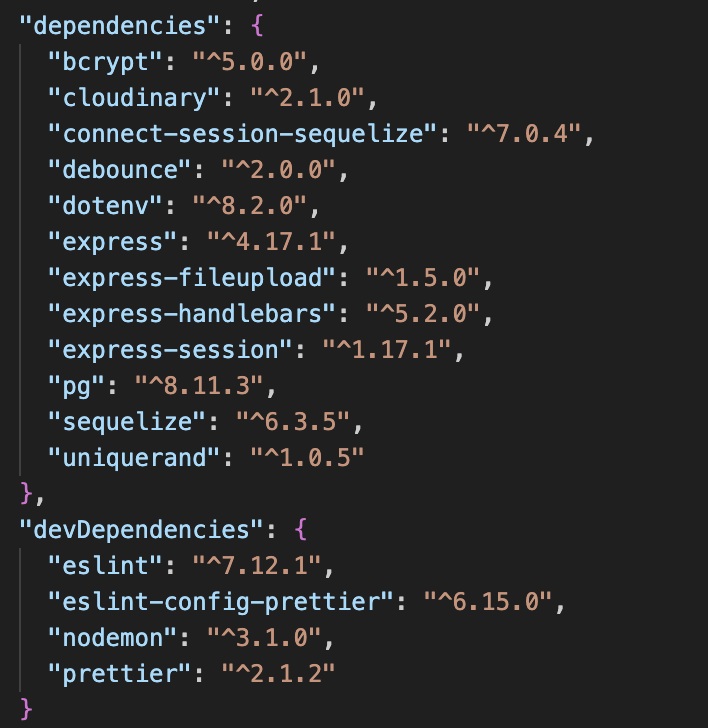
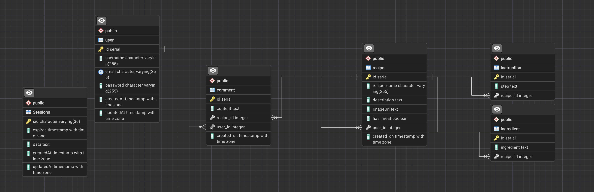

<a name="readme-top"></a>

[![Contributors][contributors-shield]][contributors-url]
[![Forks][forks-shield]][forks-url]
[![Stargazers][stars-shield]][stars-url]
[![Issues][issues-shield]][issues-url]
[![MIT License][license-shield]][license-url]
[![LinkedIn][linkedin-shield]][linkedin-url]
</br>

<br />
<div align="center">
  <a href="https://gastronome.onrender.com">

<h1 align="center">Gastrono-Me!</h1></a>

  <p align="center">

**Gastronome** is your go-to destination for culinary exploration and recipe sharing. Developed by three talented bootcamp students at the University of Denver, Gastronome offers a vibrant platform where food enthusiasts can come together to discover, share, and indulge in a world of delicious recipes. From mouth-watering appetizers to decadent desserts, Gastronome empowers users to showcase their culinary creations, engage in lively discussions, and embark on a flavorful journey of culinary discovery. Join our community today and unleash your inner chef with Gastronome!
    </br>
    </br>
    <a href="https://github.com/beckpull/gastronome"><strong>Explore the docs »</strong></a>
    </br>
    </br>
    <a href="https://gastronome.onrender.com">View Page</a>
    ·
    <a href="https://github.com/beckpull/gastronome/issues">Report Bug</a>
    ·
    <a href="https://github.com/beckpull/gastronome/issues">Request Feature</a>
  </p>
</div>

</br>
</br>

<!-- TABLE OF CONTENTS -->
<details>
  <summary>Table of Contents</summary>
  <ol>
    <li>
      <a href="#about-the-project">About The Project</a>
      <ul>
        <li><a href="#built-with">Built With</a></li>
      </ul>
    </li>
    <li>
      <a href="#getting-started">Getting Started</a>
      <ul>
        <li><a href="#prerequisites">Prerequisites</a></li>
        <li><a href="#installation">Installation</a></li>
      </ul>
    </li>
    <li><a href="#usage">Usage</a></li>
    <li><a href="#roadmap">Roadmap</a></li>
    <li><a href="#contributing">Contributing</a></li>
    <li><a href="#license">License</a></li>
    <li><a href="#contact">Contact</a></li>
     <li><a href="#acknowledgments">Acknowledgments</a></li>
  </ol>
</details>

</br>
</br>

<!-- ABOUT THE PROJECT -->

## About The Project

**Gastronome** is a recipe-sharing website built with Node.js and Express. Developed by three bootcamp students at the University of Denver, Gastronome allows users to log in, sign up, and share their favorite recipes for others to see, comment on, and try for themselves.

Key Features:

- **User Authentication**: Utilizing express-session and bcrypt, Gastronome provides a secure authentication system for users to create accounts and log in securely.

- **Recipe Sharing**: Users can easily share their recipes with the community, including ingredients, cooking instructions, and images for a comprehensive cooking experience.

- **Commenting System**: Engage in discussions and provide feedback on recipes through the commenting system, fostering a vibrant culinary community atmosphere.

- **Interactive Dashboard**: Gastronome offers an intuitive homepage for users to manage their recipes effortlessly, including updating and deleting them.

- **Image Upload**: Leveraging express-fileupload and Cloudinary, users can upload images of their dishes to accompany their recipes, enhancing the visual appeal and user experience.

- **Responsive Design**: Gastronome features a fully responsive design, ensuring seamless user experience across devices, from desktops to mobile devices.

**Gastronome** is the perfect platform for culinary enthusiasts to discover new recipes, share their culinary creations, and connect with like-minded individuals passionate about food.

<p align="right">(<a href="#readme-top">back to top</a>)</p>

### Built With

- 
- 
- ![NodeJS]
- 
- 
- 
- 
- 
- 
- 
- 
- 
- 

<p align="right">(<a href="#readme-top">back to top</a>)</p>

<!-- GETTING STARTED -->

## Getting Started

<p align="center"><i><strong>✨ Everything you need to know ✨</strong></i></p>

### Prerequisites

_This application has several dependencies, to install individually onto your machine, navigate to the directory this code lives in and type npm i <"dependency-name"> for each of these dependencies listed using your Terminal / Git Bash:_ 



### Installation

_OR, to easily get a local copy up and running follow these simple example steps:_

1. Clone the repo
   ```sh
   HTTP: git clone https://github.com/beckpull/gastronome.git
   SSH: git clone git@github.com:beckpull/gastronome.git
   ```
2. Install all necessary NPM packages
   ```sh
   npm i && npm run seed
   ```
3. Node `server.js`
   ```js
   npm start
   ```

<p align="right">(<a href="#readme-top">back to top</a>)</p>

<!-- USAGE EXAMPLES -->

## Usage

</br></br>

<div align="center"> 
<strong><i>Scan the QR code or click <a href="https://gastronome.onrender.com">HERE</a> to view this site in action!</strong>
  </br>
  </br>
  </br>
  
  </br>
  </br>
  </br>
  <p><strong></i>This is what users see upon entering the site:</i></strong></p>
  </br>
  <a href="https://gastronome.onrender.com">
   <p>Log in/Sign up</p>
    
    
  </a>
  </br></br>
  <a href="hhttps://gastronome.onrender.com">
    <p>User Homepage</p>
    
  </a>
  </br></br>
  <a href="https://gastronome.onrender.com">
    <p>Recipe Example</p>
    
  </a>
    <a href="https://gastronome.onrender.com">
    <p>Check out our responsive design!</p>
    
  </a>
  <a href="https://gastronome.onrender.com">
    <p>Recipe Example</p>
    
  </a>
  <a href="https://gastronome.onrender.com">
    <p>Recipe Example</p>
    
  </a>
</br></br>
</div>

<p align="right">(<a href="#readme-top">back to top</a>)</p>

<!-- ROADMAP -->

## Roadmap


<div align="right">
  <p><i>This was how we chose to set up our schema for this project</i></p>
</div>
</br></br></br>

<p align="right">(<a href="#readme-top">back to top</a>)</p>

<!-- CONTRIBUTING -->

## Contributing

Directions for future development:

- A vegetarian view with automatic filtering (extendable to other diets as well)
- Edit/delete comment functionality 
- Adding more than one photo to a post (Image model and attach to Recipe model)
- Implementing a ‘like’ functionality on recipes
- Global network data visualization for locations of origin for recipes and likes
- Incorporating nutritional facts
- Surprise Me! Button
- Recipe Directory with filters: such as cultural filters, dietary restriction filters, etc.
- Connecting other social platforms to enable sharing on Instagram/Facebook


Contributions are what make the open source community such an amazing place to learn, inspire, and create. Any contributions you make are **greatly appreciated**!

_If you have a suggestion that would make this better, please fork the repo and create a pull request. You can also simply open an issue with the tag "enhancement".
Don't forget to give the project a star! Thanks again!_

1. Fork the Project
2. Create your Feature Branch (`git checkout -b feature/NewFeature`)
3. Commit your Changes (`git commit -m 'Added ______ , NewFeature'`)
4. Push to the Branch (`git push origin feature/NewFeature`)
5. Open a Pull Request

See the [open issues](https://github.com/beckpull/gastronome/issues) for a full list of proposed features (and known issues).

<p align="right">(<a href="#readme-top">back to top</a>)</p>

<!-- LICENSE -->

## License

<p align='center'>Distributed under the MIT License. See `LICENSE.txt` for more information.</p>
<p align='center'>© Beck Feltman · All rights reserved.</p>

<p align="right">(<a href="#readme-top">back to top</a>)</p>

<!-- CONTACT -->

## Contact

- **Sara Hines** - [Email Sara](mailto:sara.marie.hines1@gmail.com) - or check her out on [GitHub!](https://github.com/sara-hines)
- **Vic Swain** - [Email him](mailto:huracanmusic2016@gmail.com) - or check him out on [GitHub!](https://github.com/VicSwain)
- **Rebecca Feltman** - [Email Rebecca](mailto:beckpull@icloud.com) - or check me out on [GitHub!](https://github.com/beckpull)

> Repository Link: [https://github.com/beckpull/gastronome](https://github.com/beckpull/gastronome)

<p align="right">(<a href="#readme-top">back to top</a>)</p>

<!-- ACKNOWLEDGMENTS -->

## Acknowledgments

- This README file template was created by [@othneildrew](https://github.com/othneildrew) - the original can be found [here](https://github.com/othneildrew/Best-README-Template)

#### Disclaimer:

> We utilized several articles from sources such as (but not limited to) Stack Overflow, W3Schools, and MDN Web Docs, as well as many classwork example code from the University of Denver (relied heavily on DU materials for => userRoutes.js, login/signup.js/.handlebars, postFormHandlers, etc. ) **as references** for the javascript code attached.
>
> **All of the utilized information has been altered in order to fit this project. This repository contains _solely_ our own work.**

<p align="right">(<a href="#readme-top">back to top</a>)</p>

<!-- MARKDOWN LINKS & IMAGES -->
<!-- https://www.markdownguide.org/basic-syntax/#reference-style-links -->

[contributors-shield]: https://img.shields.io/github/contributors/beckpull/gastronome.svg?style=for-the-badge
[contributors-url]: https://github.com/beckpull/gastronome/graphs/contributors
[forks-shield]: https://img.shields.io/github/forks/beckpull/gastronome.svg?style=for-the-badge
[forks-url]: https://github.com/beckpull/gastronome/network/members
[stars-shield]: https://img.shields.io/github/stars/beckpull/gastronome.svg?style=for-the-badge
[stars-url]: https://github.com/beckpull/gastronome/stargazers
[issues-shield]: https://img.shields.io/github/issues/beckpull/gastronome.svg?style=for-the-badge
[issues-url]: https://github.com/beckpull/gastronome/issues
[license-shield]: https://img.shields.io/github/license/beckpull/gastronome.svg?style=for-the-badge
[license-url]: https://github.com/beckpull/gastronome/blob/main/LICENSE
[product-screenshot]: images/screenshot.png
[NodeJS]: https://img.shields.io/badge/node.js-6DA55F?style=for-the-badge&logo=node.js&logoColor=white
[Node-url]: https://nodejs.org/en
[JQuery.com]: https://img.shields.io/badge/jQuery-0769AD?style=for-the-badge&logo=jquery&logoColor=white
[JQuery-url]: https://jquery.com
[Bulma]: https://img.shields.io/badge/bulma-00D0B1?style=for-the-badge&logo=bulma&logoColor=white
[linkedin-shield]: https://img.shields.io/badge/linkedin-%230077B5.svg?style=for-the-badge&logo=linkedin&logoColor=white
[linkedin-url]: https://linkedin.com/in/beckpull/
[stackoverflow-shield]: https://img.shields.io/badge/-Stackoverflow-FE7A16?style=for-the-badge&logo=stack-overflow&logoColor=white
[jest-shield]: https://img.shields.io/badge/-jest-%23C21325?style=for-the-badge&logo=jest&logoColor=white
[inquirer-shield]: https://img.shields.io/badge/dependency-inquirer-black
[inquirer-url]: https://www.npmjs.com/package/inquirer
